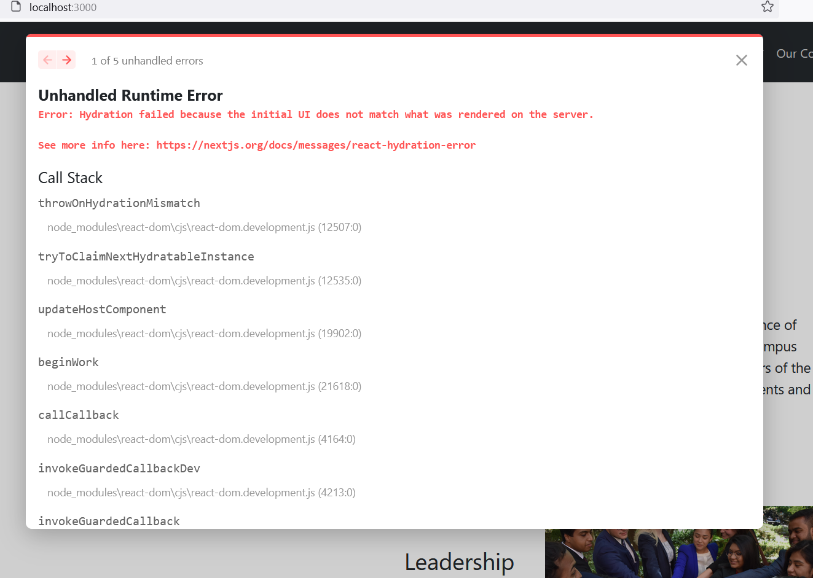

# SLC Website (Next.js)
This is a website created to for Brooklyn College's Student Leadership Council.

### Creating changes and deploying changes

[Youtube Tutorial](https://www.youtube.com/watch?v=0STyL67p16M&ab_channel=NelsonWang)

1. Make your commits to `main` branch
2. Merge changes into `deployment` branch
3. Wait for a couple minutes github will automatically deploy the changes


### How to run on your local machine

First, run the development server:
```bash
yarn run dev
```
### Details
This site is in production:
https://brooklynslcouncil.com/

You can edit the content of the webiste through our admin panel:
https://admin.brooklynslcouncil.com/public/admin

Editable content:
- Members
- Clubs
- Calendar Events
- Events Page (WIP)

### Credits
The site uses the styling and overall design from the previous SLC website: 
created by former SLC Tech Director [Mohammad Hossain](https://github.com/mohhossain) and his team.


### 2023-10-04 18:51:18 Removing Unused Packages


The objective is to remove




Deleted:


```
Removing Maps:


```
